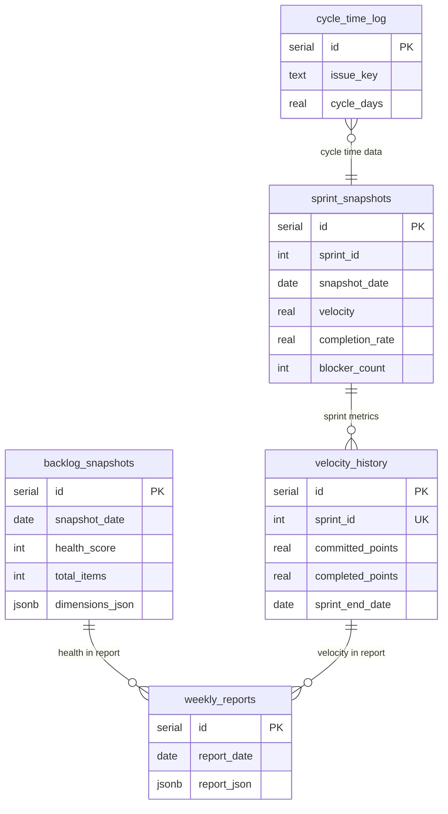

# Jira Dashboard — High-Level Architecture

## System context

```mermaid
flowchart TB
  subgraph users["Users"]
    Browser["Browser"]
  end

  subgraph app["Jira Dashboard (Next.js)"]
    direction TB
    subgraph frontend["Frontend"]
      Home["/ → redirect"]
      Dashboard["/dashboard (Sprint)"]
      Backlog["/dashboard/backlog"]
      Trends["/dashboard/trends"]
      Epics["/dashboard/epics"]
      Nav["Nav + board selector"]
    end

    subgraph api["API Routes"]
      API_Sprint["/api/jira/sprint"]
      API_Backlog["/api/jira/backlog"]
      API_Velocity["/api/jira/velocity"]
      API_Epics["/api/jira/epics"]
      API_Boards["/api/config/boards"]
      Cron_Daily["/api/cron/daily-snapshot"]
      Cron_Weekly["/api/cron/weekly-report"]
    end

    subgraph lib["Application layer"]
      JiraClient["lib/jira/client"]
      JiraSprint["lib/jira/sprint"]
      JiraConfig["lib/jira/config"]
      BacklogScoring["lib/scoring/backlog-health"]
      ReportsCompile["lib/reports/compile"]
      ReportsDispatch["lib/reports/dispatch"]
    end

    subgraph data["Data access"]
      Drizzle["Drizzle ORM"]
    end
  end

  subgraph external["External systems"]
    Jira["Jira Cloud API"]
    Neon["Neon (Postgres)"]
    Resend["Resend (Email)"]
    Slack["Slack (Webhook)"]
  end

  Browser --> Home
  Browser --> Dashboard
  Browser --> Backlog
  Browser --> Trends
  Browser --> Epics
  Browser --> API_Sprint
  Browser --> API_Backlog
  Browser --> API_Velocity
  Browser --> API_Epics
  Browser --> API_Boards

  API_Sprint --> JiraSprint
  API_Backlog --> JiraClient
  API_Backlog --> BacklogScoring
  API_Velocity --> Drizzle
  API_Epics --> JiraClient
  API_Boards --> JiraConfig
  API_Boards --> Jira

  JiraSprint --> JiraClient
  JiraClient --> JiraConfig
  JiraClient --> Jira

  Cron_Daily --> JiraSprint
  Cron_Daily --> JiraClient
  Cron_Daily --> BacklogScoring
  Cron_Daily --> Drizzle
  Cron_Weekly --> ReportsCompile
  ReportsCompile --> Drizzle
  ReportsDispatch --> Cron_Weekly
  Cron_Weekly --> ReportsDispatch
  ReportsDispatch --> Resend
  ReportsDispatch --> Slack

  Drizzle --> Neon
```



## Data flow

```mermaid
flowchart LR
  subgraph read_path["Read path (user-facing)"]
    A[Browser] --> B[Jira API routes]
    B --> C{Data source}
    C -->|Sprint, Backlog, Epics| D[Jira API]
    C -->|Velocity, history| E[Neon Postgres]
  end

  subgraph write_path["Write path (cron)"]
    F[Vercel Cron / external] --> G[/api/cron/daily-snapshot]
    G --> H[Jira API]
    G --> I[Neon Postgres]
    F --> J[/api/cron/weekly-report]
    J --> K[Neon Postgres]
    J --> L[Resend / Slack]
  end
```

## Component overview

| Layer | Components | Responsibility |
|-------|------------|----------------|
| **Frontend** | Next.js App Router pages, SWR hooks, Recharts | Dashboard UI, board selector, polling |
| **API** | `/api/jira/*`, `/api/config/boards`, `/api/cron/*` | Server-side data aggregation, cron jobs |
| **Application** | `lib/jira/*`, `lib/scoring/*`, `lib/reports/*` | Jira client, sprint/backlog logic, health scoring, report compile & dispatch |
| **Data** | Drizzle ORM, `db/schema` | Persistence: snapshots, velocity history, cycle time, weekly reports |
| **External** | Jira Cloud, Neon, Resend, Slack | Source of truth (Jira), persistence, notifications |

## Database (Neon Postgres)



## Key integration points

- **Jira**: All live sprint, backlog, and epics data via REST Agile API; auth via `JIRA_API_EMAIL` + `JIRA_API_TOKEN`; boards from `JIRA_BOARD_IDS`.
- **Neon**: Optional for Phase 1; required for velocity history, daily snapshots, and weekly reports. Connection via `DATABASE_URL`.
- **Cron**: `daily-snapshot` and `weekly-report` protected by `Authorization: Bearer CRON_SECRET`; typically triggered by Vercel Cron or an external scheduler.
- **Resend / Slack**: Optional; weekly report delivery via `RESEND_API_KEY` + `REPORT_EMAIL_*` and/or `SLACK_WEBHOOK_URL`.
